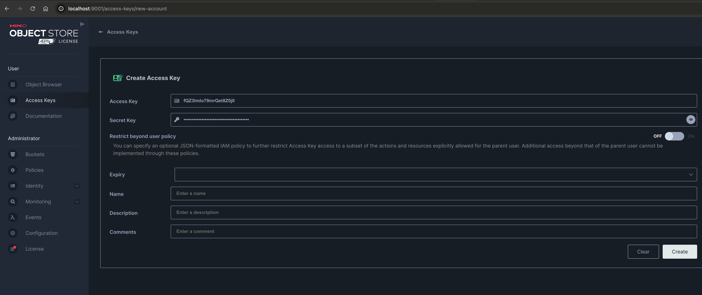

# 🚀 MinIO Local Setup Guide

This guide will help you set up and use **MinIO** locally using **Docker Compose**.  
MinIO is an S3-compatible object storage solution that you can use for local development.

---

## 📌 1. Configure MinIO User and Password

Before starting MinIO, you need to configure **MINIO_ROOT_USER** and **MINIO_ROOT_PASSWORD** in the `docker-compose.yml` file.

Modify your **docker-compose.yml** as follows:

```yaml
version: '3.8'
...
services:
    minio:
      ...
      environment:
        MINIO_ROOT_USER: admin  # Set your user
        MINIO_ROOT_PASSWORD: ****  # Set your password
      
...
```

---

## 📌 2. Start MinIO Using Docker Compose

Run the following command to start the **MinIO** container:

```bash
docker-compose up -d
```

✅ This will start MinIO as a background process.

To check if the container is running:

```bash
docker ps | grep minio
```

---

## 📌 3. Access MinIO Web Console

Once the container is running, open your browser and go to:

🔗 **[http://localhost:9001](http://localhost:9001)**

Login using the credentials set in `docker-compose.yml`:

- **Username:** `admin`
- **Password:** ****

Here, you can **create buckets, upload files, and manage objects**.

---

## 📌 4. Generate Access Key and Secret Key

To interact with MinIO programmatically, you need an **Access Key** and **Secret Key**. These credentials allow your application to authenticate and perform operations in MinIO.

### 🔹 Steps to Generate Credentials in MinIO Web Console

1. Open your browser and go to **http://localhost:9001**.
2. Log in with your **root user credentials**.
3. Navigate to **Access Keys** in the left menu.
4. Click on **Create access key +**.
5. Click **Create** to generate the **Access Key** and **Secret Key**.
6. Copy and store the credentials, as they will not be shown again.

Below is an image showing where to generate the credentials:



> **Note:** These credentials are essential for integrating MinIO with external applications, including Java.

---

## 📌 5. Set Up Environment Variables for Credentials

To use the **Access Key** and **Secret Key**, you should configure them as global environment variables. There are two ways to do this:

### 🔹 Option 1: Using `export` (Linux/Mac)

Run the following commands in your terminal:

export MINIO_ACCESS_KEY="your-access-key"  
export MINIO_SECRET_KEY="your-secret-key"

To make these variables persistent, add them to your `~/.bashrc` or `~/.zshrc` file.

### 🔹 Option 2: Using `docker-compose.yml`

Modify your `docker-compose.yml` file to include the credentials as environment variables:

environment:  
MINIO_ACCESS_KEY: "your-access-key"  
MINIO_SECRET_KEY: "your-secret-key"

---

## 📌 6. Integrate MinIO with Java

To integrate MinIO with Java, you can use the **MinIO Java SDK**.

> **Note:** The following code examples are provided for demonstration purposes only and are not necessarily the implementations required for the challenge.

### 🔹 Add MinIO SDK Dependency (Maven)

```xml
<dependency>
    <groupId>io.minio</groupId>
    <artifactId>minio</artifactId>
    <version>8.5.7</version> <!-- Use the latest version -->
</dependency>
```

### 🔹 Example: Upload a File to MinIO

```java
import io.minio.MinioClient;  
import io.minio.UploadObjectArgs;

public class MinioUploadExample {  
public static void main(String[] args) throws Exception {  
MinioClient minioClient = MinioClient.builder()
        .endpoint("http://localhost:9000")
        .credentials("YOUR-ACCESSKEYID", "YOUR-SECRETACCESSKEY")
        .build();

        minioClient.uploadObject(  
                UploadObjectArgs.builder()  
                        .bucket("my-bucket")  
                        .object("example.pdf")  
                        .filename("/path/to/local/file.pdf")  
                        .build()  
        );  

        System.out.println("File uploaded successfully!");  
    }  
}
```

### 🔹 Example: Generate a Pre-Signed URL

```java
import io.minio.MinioClient;  
import io.minio.GetPresignedObjectUrlArgs;  
import io.minio.http.Method;

public class MinioPresignedUrlExample {  
public static void main(String[] args) throws Exception {  
MinioClient minioClient = MinioClient.builder()
        .endpoint("http://localhost:9000")
        .credentials("YOUR-ACCESSKEYID", "YOUR-SECRETACCESSKEY")
        .build();

        String url = minioClient.getPresignedObjectUrl(  
                GetPresignedObjectUrlArgs.builder()  
                        .bucket("my-bucket")  
                        .object("example.pdf")  
                        .method(Method.GET)  
                        .build()  
        );  

        System.out.println("Download URL: " + url);  
    }  
}
```

For more advanced configurations and API documentation, refer to:  
📄 **[MinIO Java SDK Documentation](https://min.io/docs/minio/linux/developers/java/API.html)**

---

## 🎯 Summary

✅ Configured MinIO user and password in `docker-compose.yml`.
✅ Started MinIO using `docker-compose up -d`.
✅ Accessed MinIO Web Console at `http://localhost:9001`.
✅ Generated Access Key and Secret Key for authentication.
✅ Configured credentials as **environment variables** for security.
✅ Integrated MinIO with Java for **uploading files and generating download URLs**.

🚀 Now you can use MinIO as **local S3-compatible storage** for development!
